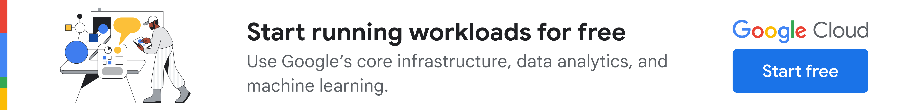
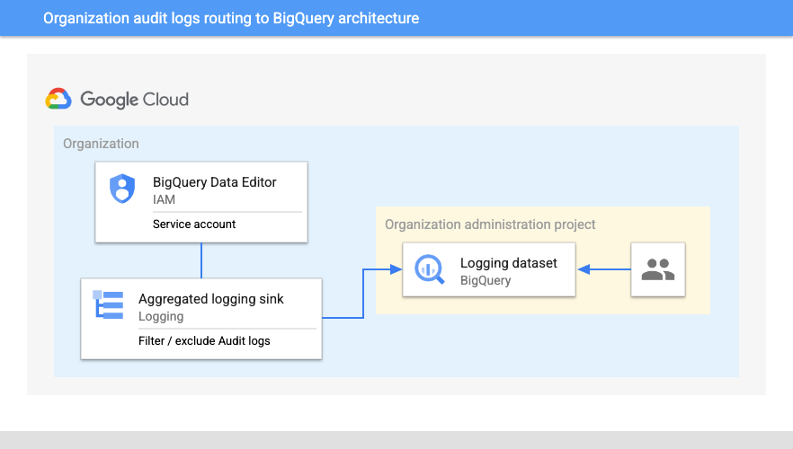
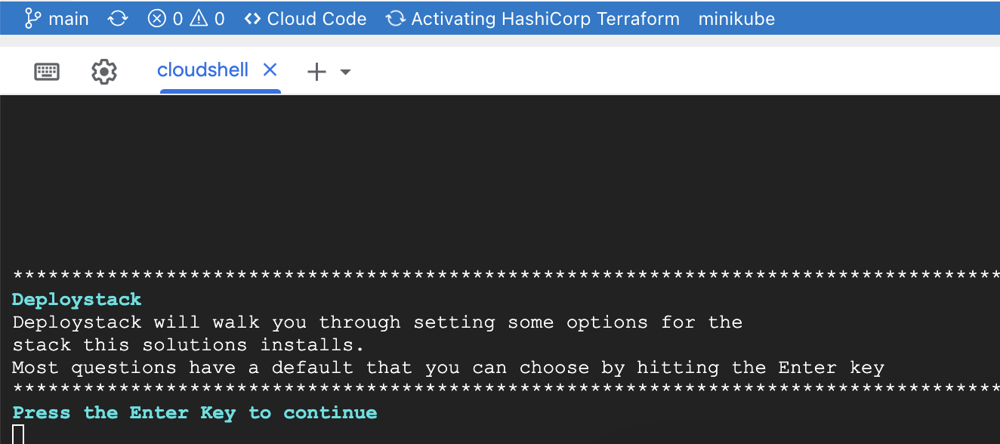

[](https://cloud.google.com/?utm_source=github&utm_medium=referral&utm_campaign=GCP&utm_content=packages_repository_banner)
# Analyze Audit Logs for a GWS or Google Cloud Organization with Big Query

## Introduction

Google Cloud offers a wide range of services to help you build and run applications.While external users bring unique challenges to security, it's important to note that potential security threats may also originate from **within your own organization**. That's why it's important to monitor your Google Cloud environment for suspicious activity.

One way to do this is to collect and store Audit Logs. Audit Logs record all activity in your Google Cloud environment, including **who** made changes, **when** they were made, and **what** resources were affected. This information can be invaluable for troubleshooting security incidents and identifying potential compliance violations and for internal audits and visibility.

Managing audit logs, though essential, can require significant time and effort. That's where it can be useful to analyze Audit Logs in BigQuery. The following **click-to-deploy** architecture automates the process of collecting and storing organization audit logs in BigQuery.

**BigQuery** is a serverless, highly scalable, cost-effective data warehouse. It's the perfect place to store audit logs because it makes it easy to query and analyze them.

With this click-to-deploy, you can:

* Collect audit logs from all projects in your organization
* Store audit logs in BigQuery
* Query audit logs using SQL
* Use audit logs to troubleshoot security incidents
* Identify potential compliance violations

## Use cases

### Google Workspace organization monitoring

By filtering on specific events like a login failure, admin rights grant, Google Drive ownership change or any security settings change etc., This architecture empowers organization administrators to proactively identify subtle indicators of security breaches or compliance gaps across the organization and its users.
For more information, please refer to the [Google Workspace Reports API](https://developers.google.com/admin-sdk/reports/v1/appendix/activity/admin-event-names) and the [Audit logs for Google Workspace pages](https://cloud.google.com/logging/docs/audit/gsuite-audit-logging).

### Google Cloud Data access auditing

As we store and consume a growing volume of data and insights, securing assets like data has become a high priority. This is true on both competitive and regulatory aspects of a business. Not only is data a differentiator but since the GDPR, poor security and compliance processes around data accesses can lead to major fines that can put a business at risk both on financial and reputational aspects. This is especially true for businesses handling PII data that need strict auditing to ensure accesses and edits are recorded and monitored. The [Data Access audit logs](https://cloud.google.com/logging/docs/audit#data-access) allow an administrator to monitor data read / writes on these assets as well as oversee accesses to Google Cloud product configuration or metadata.

### Google Cloud system events monitoring

System Event audit logs are log entries generated by Google System for actions that modify configuration of resources such as a VM live migration without any user interaction.
Depending on the architecture, these events can interact with customers' services availability and reliability. Having this information accessible through an easy interface like BigQuery allows customers to gain clear visibility on these events as well as help them investigate service degradation and eventually improve their overall architecture resilience to system events.
Many support cases open today because these events occur without the customers knowing.

### And more…  

This architecture is naturally compatible with other critical audit log types:

* [Admin Activity](https://cloud.google.com/logging/docs/audit#admin-activity) audit logs: record of any configuration or metadata changes made to a Google Cloud resource inside an organization
* [Policy Denied](https://cloud.google.com/logging/docs/audit#policy_denied) audit logs: record any Google Cloud Services Controls violation

Note that the Google Workspace Reports API offers a [native export to BigQuery](https://support.google.com/a/answer/9079365?hl=en#) that is available for Enterprise, Education Standard and Education Plus editions.

## Dependencies

This repository uses modules provided by this [repository](https://github.com/GoogleCloudPlatform/cloud-foundation-fabric).

## Architecture



The main components that are deployed in this architecture are the following (you can learn about them by following the hyperlinks):

* [Cloud logging aggregated sinks](https://cloud.google.com/logging/docs/export/aggregated_sinks): combine and route log entries from the resources container by an organization or a folder.
* [BigQuery](https://cloud.google.com/bigquery): managed data warehouse solution that offers a powerful scalable SQL engine for analytical workloads
* [Service accounts](https://cloud.google.com/iam/docs/service-accounts): credentials used by Google Cloud services to interact with other Google Cloud components

## Costs
Pricing Estimates - We have created a sample estimate based on some usage we see from new startups looking to scale. This estimate would give you an idea of how much this deployment would essentially cost per month at this scale and you extend it to the scale you further prefer. Here's the [link](https://cloud.google.com/products/calculator#id=6506829f-9fbc-4d6c-ba68-1ae035c2e745).

## Setup

### Prerequisites

#### Google Workspace data sharing enabled

If you are interested to route Google Workspace audit logs to Google Cloud, this will require to enable data sharing between both environments. To enable sharing Google Workspace data with Google Cloud from your Google Workspace, Cloud Identity, or Drive Enterprise account, follow the instructions in [Share data with Google Cloud services](https://support.google.com/a/answer/9320190).

#### Setting up the project for the deployment

This example will deploy all its resources into the project defined by the `project_id` variable. Please note that we assume this project already exists. 

### Deployment

Before we deploy the architecture, you will at least need the following information (for more precise configuration see the Variables section):

* The project Id.
* The organization Id (as mentioned [here](https://cloud.google.com/sdk/gcloud/reference/projects/get-ancestors), the following command outputs the organization: `gcloud projects get-ancestors PROJECT_ID`)
* A dataset Id to export logs to (see [naming conventions](https://cloud.google.com/bigquery/docs/datasets#dataset-naming)). Note: this will create a new dataset (to use an existing dataset, see the following section below: "Use an already existing BigQuery dataset")
* A log filter which is a Cloud Logging log query (see [documentation](https://cloud.google.com/logging/docs/view/logging-query-language)) used to target specific audit logs to route to BigQuery. Note that you'll need to escape the quotes symbols.
For example filters, please see the next section in this ReadMe.
* Identity groups for both Owner and Reader role on the BigQuery dataset. 
* It is recommended to grant the [Logging Admin IAM role](https://cloud.google.com/iam/docs/understanding-roles#logging.admin) to the person running this script.

[](https://shell.cloud.google.com/cloudshell/editor?cloudshell_git_repo=https://github.com/GoogleCloudPlatform/deploystack-auditlogs-to-bq&cloudshell_image=gcr.io%2Fds-artifacts-cloudshell%2Fdeploystack_custom_image&cloudshell_git_branch=main&cloudshell_tutorial=tutorial.md)

In the event of an issue, you have the option to easily relaunch the ephemeral Cloud Shell environment by clicking the button again. Alternatively, you can execute the following command in the same shell:

``` {shell}
deploystack install
```

*In case of any issues* during the process, please refer to the section below and follow the manual steps to delete the audit log sink before rerunning the command.

If a warning about an undeclared variable appears, you can safely disregard it.

This is the startup screen that appears after clicking the button and confirming:



During the process, you will be asked for some user input. All necessary variables are explained at the bottom of this ReadMe file. In the rare event of a failure, you can easily retry by clicking the button again.

<center>
<h4>🎉 Congratulations! 🎉  <br />
You have successfully deployed your environment.</h4></center>

### Clean Up Your Environment

The easiest way to remove all the deployed resources is to run the following command in Cloud Shell:

``` {shell}
deploystack uninstall
```

The above command will delete the associated resources so there will be no billable charges made afterwards.
In order to remove all of the resources, you will need to delete the Logging Sink that it creates at an organisational level. To do this, please complete the following steps:

* Navigate to *Cloud Logging*
* Navigate to *Logs Router*
* In the menu at the top, please select your organisation
* Delete the entry of type BigQuery dataset named audit-log-org-sink

Note: This will also destroy the BigQuery dataset as the following option in `main.tf` is set to `true`: `delete_contents_on_destroy`.

### Standalone deployment

Since the scripts are based on Terraform, it is possible to deploy this solution through `Terraform` directly, without having to go through `Deploystack`.
Just clone this repo, create a `terraform.tfvars` file with your own values and call the following commands:
``` {shell}
terraform init
terraform plan -out=execplan.out
terraform apply execplan.out
```

### Customizing to Your Environment

In this section you will find different ways to customise the architecture to your needs.

#### Example Log Filters

**GWS Audit Log Filter Example**
This filter filters all of the audit logs concerning Google Workspace into the BigQuery dataset. These logs will tell you who created, edited, and/or deleted any resource and when this was done. This is mainly useful for auditing purposes, or to find out when a critical change to a resource was made.
```protoPayload.methodName:\"google.admin.\"```

**Data Access Audit Log Filter Example**
This filter filters all of the logs concerning accessed data into the BigQuery dataset. 
```logName=\"projects/PROJECT_ID/logs/cloudaudit.googleapis.com%2Fdata_access\"```

**System Events Audit Log Filter Example**
This filter filters all of the logs related to system events into the BigQuery dataset.
```logName=\"projects/PROJECT_ID/logs/cloudaudit.googleapis.com%2Fsystem_event\"```

#### Use A Pre-Existing BigQuery Dataset

In order to push the audit logs to a BigQuery dataset that already exists in a project, follow these steps:

1. Remove the `"bigquery-dataset"` module block at the end of the [`main.tf`](main.tf#L42) file.
2. Replace the following line in the `"google_logging_organization_sink"` resource block

```{terrafom}
  destination      = "bigquery.googleapis.com/projects/${var.project_id}/datasets/${module.bigquery-dataset.dataset_id}"
```

with:

```{terrafom}
  destination      = "bigquery.googleapis.com/projects/${var.project_id}/datasets/${var.dataset_id}"
```
